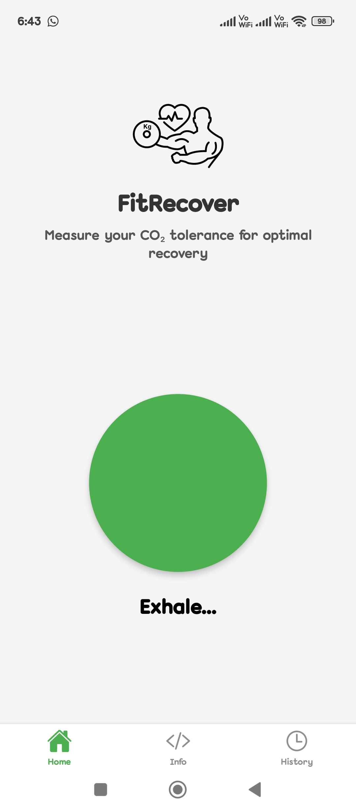
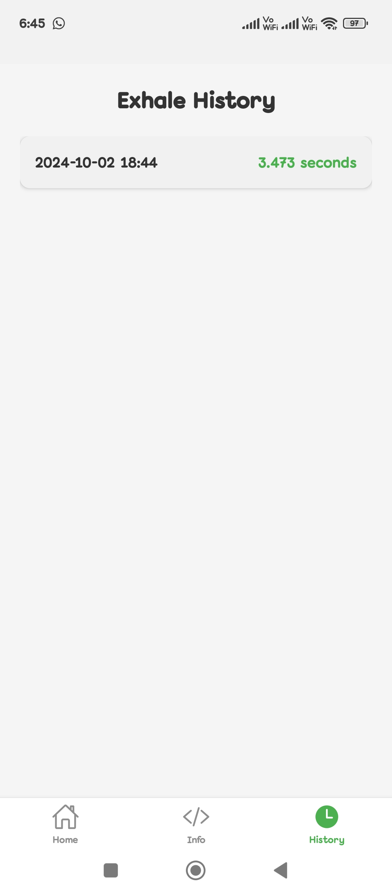
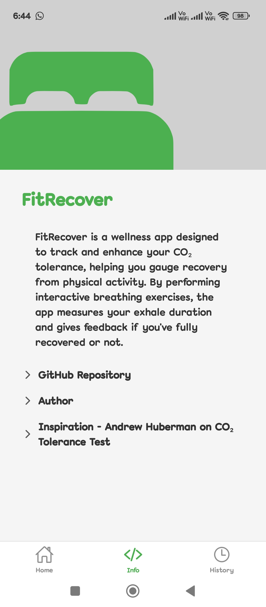
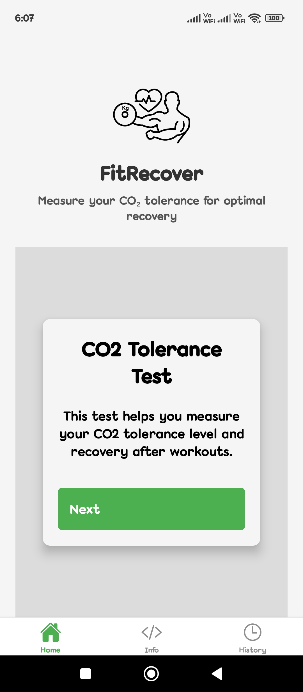

# FitRecover

FitRecover is a mobile application designed to track CO2 tolerance tests, helping users understand their recovery status after workouts. The app features an interactive interface where users can perform inhale/exhale exercises, with data stored for historical analysis.

## Features

- **Interactive CO2 Tolerance Test**: Users can perform a series of inhalations and exhalations, with visual feedback and instructions.
- **History Tracking**: The app records each test's results, providing a detailed history of exhalation times.
- **User-Friendly Interface**: Clean and intuitive design with responsive animations.
- **Customizable Metrics**: Users can track their exhalation duration and view their progress over time.

## Technologies Used

- **React Native**: For building the mobile app across iOS and Android.
- **Expo**: For rapid development and testing of the React Native app.
- **TypeScript**: To ensure type safety and improve development efficiency.
- **AsyncStorage**: For persisting user data locally on the device.

## Getting Started

### Prerequisites

Before you begin, ensure you have the following installed on your machine:

- [Node.js](https://nodejs.org/) (v14 or higher)
- [Expo CLI](https://docs.expo.dev/get-started/installation/) (Install with `npm install -g expo-cli`)
- A code editor like [Visual Studio Code](https://code.visualstudio.com/)

### Installation

1. **Clone the Repository**:
   ```bash
   git clone https://github.com/pratik-londhe4/FitRecover.git
   cd FitRecover
2. **Install Dependencies**:
   ```bash
   npm install
   ```
3. **Run the App**:
   ```bash
   npm run
   ```
Use the Expo Go app on your mobile device or an emulator to scan the QR code displayed in your terminal.

## Usage

### Starting the Test
- Tap the "Start" button to initiate the inhale/exhale cycle.
- Follow on-screen instructions for each inhale and exhale.

### Viewing History
- Access the history tab to view previous exhalation times formatted as "YYYY-MM-DD HH:MM".

## Future Enhancements

- Reminders for daily CO2 tolerance tests.


## Screenshots

|  |  |
| :-----------------------------------------------------: | :-----------------------------------------------------: |
|  |  |
